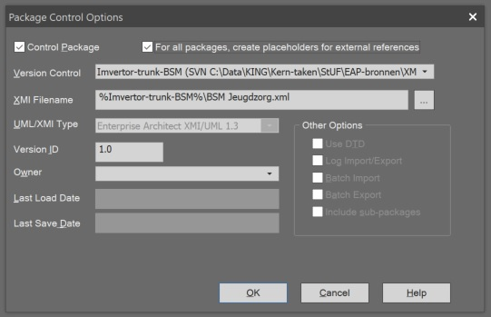

# 4.1 Het gebruik van SVN

In dit hoofdstuk beschrijven we hoe we binnen VNG-realisatie i.h.k.v. de Nieuwe Aanpak omgaan met het beheer van onze modellen. Het aantal modellen dat we in beheer hebben neemt vlug toe en aangezien de relaties tussen deze modellen een spaghetti aan afhankelijkheden oplevert is het van groot belang dat de procedure voor het gezamenlijk werken aan deze modellen voor iedereen duidelijk is en ook toegepast wordt.
Omdat bij dat beheer SVN een centraal onderdeel is zijn hieronder de belangrijkste SVN handelingen beschreven. In de paragraaf daaronder beschrijven we de te hanteren procedure waarbij je gebruik maakt van de beschreven SVN handelingen.

Randvoorwaarde om SVN binnen Enterpise Architect te kunnen gebruiken is dat Tortoise SVN geïnstalleerd is en en dat Enterprise Architect is geconfigureerd om de repository met Informatiemodellen, Gegevensmodellen en Berichtmodellen te kunnen gebruiken. Zie onder [1 Installatie](./Installatie.md) de paragraaf  *SVN configureren voor EA*.

### Het vastleggen van een nieuw model (package) in de repository

Als er een nieuw model wordt gemaakt in Enterprise Architect, om het even of dat nu een SIM, UGM of BSM is, en dat model moet opgenomen worden in de SVN-repository, dan moet op het niveau van de model-package aangegeven worden dat deze package opgenomen moet worden in de repository.
* Selecteer de betreffende package en kies via de linkermuis-knop de keuze 'Package Control' en in het Sub-menu de keuze 'Configure'.
* Kies in het pop-up menu de keuze 'Configure'.
* Klik het vinkje bij 'Control Package' aan.
* Selecteer bij  Version Control de repository die bij het installeren van SVN is geconfigureerd. (Met het pijltje aan de rechterkant van de het invoerveld.  
* Voer bij XMI Filename de bestandsnaam in waarmee deze package opgeslagen.
* Klik op 'OK'.

In Enterprise Architect 15.1 kan dit menu gevonden worden via het menu *Publish > Model Exhange > Package Control > Configure > Package Control...*.

De bestandsnaam voldoet daarbij aan de volgende conventie:

> [Modeltype] [Domein (al dan niet als afkorting)].xml

Modeltype is daarbij gelijk aan 'SIM', 'UGM' of 'BSM'. Enkele voorbeelden hiervan zijn 'SIM RSGB.xml' of 'BSM Bevraging Bewoning.xml'.

### Het ophalen van een bestaand model (package).

Randvoorwaarde voor het ophalen van een model uit de repository in Enterprise Architect is dat er een standaard projecten structuur aanwezig is in het EA-bestand. Om te waarborgen dat dit het geval is dien je bij het aanmaken van een nieuw EA bestand een kopie te maken van het EA Template bestand dat je kunt vinden in de folder die je n.a.v. de tweede bullet van de sectie [SVN configureren voor EA](./Installatie#1.1.7%20SVN%20configureren%20voor%20EA) hebt aangemaakt of gekozen.

Het ophalen van een model wordt gedaan door een Get package uit te voeren:

* Selecteer de project-package waaronder het model moet worden opgenomen.
* Ga via de linkermuisknop naar de menukeuze "Package Control" en selecteer in het sub-menu "Get Package...".
* Selecteer de locatie waar het gewenste model is opgeslagen. De locaties die hier beschikbaar zijn zijn bij het configureren van Version Control in EA aangebracht (zie hoofdstuk 1: [SVN configureren voor EA](./Installatie#1.1.7%20SVN%20configureren%20voor%20EA).
* Selecteer het model dat je vanuit de repository in Enterprise Architect beschikbaar wilt hebben en klik op "OK".

Het model wordt nu binnengehaald  en onder de package gezet die  je in de eerste stap hebt geselecteerd.

*Let op*: Het binnenhalen van een stelsel aan packages dient in de juiste volgorde te gebeuren. Dus eerst de SIM packages waar andere SIM packages van afhankelijk zijn, daarna die andere SIM packages en daarna hetzelfde voor de UGM packages en tenslotte het BSM package. Voor het bepalen van de juiste volgorde verwijs ik naar "het Supplieroverzicht":https://vvng.sharepoint.com/sites/UnitArchitectuurenStandaarden/Gedeelde%20documenten/General/De%20nieuwe%20aanpak/Supplieroverzicht.html. De in dit overzicht op het laagste niveau voorkomende modellen (de modellen die het verste inspringen) moeten als eerste binnengehaald worden.

### Bewerken van een model

Een model dat is opgehaald is altijd ingechecked. Als je een model wilt bewerken moet je het uitchecken. Dat doe je als volgt:
* Selecteer het model-package dat je wilt wijzigen.
* Ga via de linkermuisknop naar de menukeuze "Package Control" en selecteer in het sub-menu "Check Out...".
De meest recente versie van het model wordt nu binnengehaald  (dat is dus eigenlijk meteen een "Get Latest") en opengezet voor het aanbrengen van wijzigingen.
Ook wordt het model gelocked voor wijzigingen door anderen. Het is dus raadzaam om modellen niet onnodig uitgechecked te laten staan. Tevens voorkomt dat problemen als je het package ook in een ander EA bestand gebruikt en het zonder daar erg in te hebben ook daar zou uitchecken.

Na het aanbrengen van de wijzigingen kan je het model weer inchecken en dat doe je als volgt :
* Selecteer het model-package dat je wilt inchecken.
* Ga via de linkermuisknop naar de menukeuze "Package Control" en selecteer in het sub-menu "Check In...".

### Raadplegen van een model.

Modellen die je opgenomen hebt in je EA-bestand worden niet automatisch bijgewerkt. Op het moment dat iemand anders in een model een wijziging heeft aangebracht moet die wijziging pro-actief opgehaald worden.
Dat kan op 2 manieren. Je kunt de laatste versie van een specifiek model ophalen door het volgende te doen.
* Selecteer het model-package dat je wilt updaten.
* Ga via de linkermuisknop naar de menukeuze "Package Control" en selecteer in het sub-menu "Get Latest...".

Als je alle modellen die in jouw EA-betand zitten wilt updaten (aanrader) dan kies je in de bovenstaande situatie voor de keuze "Get All Latest".

### Verwijderen van modellen

Indien je een model uit je EA-bestand wilt verwijderen kan dat door de package te verwijderen.
* Selecteer het model-package dat je wilt verwijderen.
* Ga via de linkermuisknop naar de menukeuze "Delete (Packagenaam)".

*Let op*: een model dat in  Version Control is opgenomen kan later weer opgehaald worden (zie boven). Echter een model of package dat niet in Version Control is opgenomen wordt hiermee definitief verwijderd en is niet meer terug te halen.

*Let op 2*: Pas wel op met de volgorde van weggooien en vooral inladen. Als je een model verwijderd waarnaar vanuit een ander model verwezen wordt dan zijn in laatstgenoemd model in de diagrammen de verwijzingen naar eerstgenoemd model weg. Deze verwijzingen komen niet meer terug. Dus als je zo'n eerstgenoemd model verwijderd, verwijder dan eerst alle modellen die daarnaar verwijzen en laad ze (indien gewenst)  'van boven naar beneden' weer opnieuw in.

### Updaten van modellen

De meeste modellen hebben een afhankelijkheid van andere modellen. Op die andere modellen vindt beheer plaats en het kan dus voorkomen dat je n.a.v. het beschikbaar komen van een nieuwe versie in je EA bestand de oude versie van een model moet vervangen door een nieuwe versie van datzelfde model. In principe wordt van elke versie een tag vastgelegd (zie volgende hoofdstuk) en vervangen van een model betekent dus eigenlijk dat je een model dat verwijst naar een specifieke tag verwijdert en de nieuwe tag voor dat model weer inleest.
De modellen zijn echter d.m.v. traces aan elkaar gelinkt en bij het vervangen van een model wil je niet dat deze traces verloren gaan. Om dat te voorkomen moet je de volgende procedure hanteren:

 - Check eerst alle modellen die je in het EA bestand hebt uitgecheckt weer in;
 - Verwijder nu het te vervangen model;
 - Lees de nieuwe tag in;
 - Voer een 'Get All Latest' uit.

Daarmee is de nieuwe versie weer beschikbaar in EA en zijn de traces behouden. Nu dien je je eigen model(len) weer in lijn te brengen met het zojuist vervangen model.

### Procedure modellenbeheer

Zie ook het bijgaande [Presentatie Procedure modellenbeheer](./bestanden/Subversion%20gebruik%20in%20Enterprise%20Architect.pdf) Deze presentatie is echter slechts ter ondersteuning, de onderstaande procedure is in die zin normatief.

### Opbouwen EA modellen structuur

Het is bij het laden van de benodigde modellen van groot belang dat je de modellen in de juiste volgorde in EA ophaalt. Om die reden dien je voordat je gaat ophalen een goed beeld te hebben van de benodigde modellen en van de volgorde van ophalen. Hiervoor is de tabel 'Tags model-supplier overzicht' die je "hier":https://vvng.sharepoint.com/sites/UnitArchitectuurenStandaarden/Gedeelde%20documenten/General/De%20nieuwe%20aanpak/Supplieroverzicht.html vindt onontbeerlijk. Deze tabel wordt regelmatig ververst dus het is verstandig dit bestand steeds weer opnieuw te downloaden. Welke modellen je nodig hebt is o.a. afhankelijk van de rol waarin je een model gebruikt.

Indien je als beheerder een bestaand model gaat bewerken dan moet je dat model zoeken in de 'trunk' of in de 'branches' folder van de repository. Wil je van scratch af aan een nieuw model gaan opbouwen dan haal je geen model op uit de trunk' of 'branches' folder maar dan ga je juist een nieuw model in de trunk plaatsen.
Over het algemeen zul je echter de meeste modellen alleen als gebruiker op willen halen. Dit zijn de modellen waar jij zelf niet verantwoordelijk voor bent en in dat geval zoek je in de 'tags' folder en daarvoor is de eerder genoemde tabel handig. Je mag er trouwens vanuit gaan dat de modellen die in de tags folder staan ook aanwezig zijn op de Imvertor server. De eigenaar van een model heeft immers de verantwoording om dat model op de Imvertor server te processen voordat hij/zij een verzoek tot het aanmaken van een tag plaatst.

 - Bij het maken van het overzicht begin je bij het model dat je wil gaan bewerken. Bepaal aan de hand van de tabel of, als het model nog niet in de tabel is opgenomen, zelfstandig van welke versie van modellen je model afhankelijk is of afhankelijk moet worden;
 - Bepaal vervolgens van welke modellen deze gevonden modellen afhankelijk zijn;
 - herhaal de voorgaande stap totdat er geen modellen meer zijn die afhankelijk zijn van andere modellen;
 - Nu ga je de modellen die je gevonden hebt één voor één binnenhalen in EA, te beginnen bij de laatst gevonden modellen. Over het algemeen zul je eerst de SIM modellen binnenhalen, daarna (indien van toepassing) de UGM modellen en tenslotte (wederom indien van toepassing) de BSM modellen;
 - Dit herhaal je vervolgens weer totdat je bij het model dat je wil bewerken of, als dat model nog niet bestaat, bij de modellen waar deze afhankelijk is bent aangekomen;
 - je bent nu klaar om in EA te gaan werken.

### Het aanvragen en vervaardigen van een tag

Binnen SVN maken we gebruik van tags om een opname te maken van onze modellen op een formeel moment. Een voorbeeld van zo'n moment is de start van een openbare consultatie maar het kan ook zijn dat je je model rijp genoeg acht voor het eerste gebruikt door je collega's. Een tag is altijd een read-only bestand. Op een tag kunnen dus geen wijzigingen meer worden aangebracht. Zitten er fouten in een tag dan is de enige remedie deze te vervangen door een andere tag. Voorwaarde voor het vervaardigen van een tag is dat deze minimaal foutvrij door Imvertor komt.

Hoe ga je te werk.
 - Zorg er voor dat je je model hebt ingecheckt. Het staat dus in de 'trunk' of 'branches' folder;
 - Verwerk het model nog eenmaal met Imvertor. Dit zorgt er voor dat er voor elke tag een overeenkomend model op de Imvertor server is;
 - Stuur een verzoek voor het aanmaken van een tag naar de administrator van de NieuweAanpak (NA) repository en verstrek deze daarbij de volgende informatie:
  - De bestandsnaam van het te taggen model;
  - Het versienummer van het te taggen model in het volgende formaat nn_nn_nn;
  - De releasedatum van het te taggen model (*Let op!* dit is de waarde van de tagged value 'release' die op het package gedefinieerd is);
  - De status van het te taggen model. We kennen de volgende statussen: (Wellicht nog niet compleet)
    - In ontwikkeling
    - In beoordeling
    - Gereed voor UGM
      Deze status wordt alleen gebruikt bij een SIM. Hiermee geef je aan dat je nog wel aan het werk bent in de SIM maar dat hij voldoende gereed is om te worden verwerkt tot een SIM. Een SIM hoeft niet verplicht deze stap te doorlopen.
    - In gebruik
  - In geval van een geheel nieuw model een lijstje met modellen waar het nieuwe model van afhankelijk is.
  - Na ontvangst van het verzoek zal de administrator de tag aanmaken. Daarbij hanteert hij als het origineel in de trunk staat de volgende naamgevingsconventie:
_[bestandsnaam in de trunk minus de extensie] [versienummer] [status] R[releasedatum].xml_
of als het origineel in de branch staat:
_[bestandsnaam in de branch minus de datum en extensie] R[releasedatum].xml_;
  - Nadat de tag is vervaardigd stelt de administrator de opdrachtgever op de hoogte. De opdrachtgever zal vervolgens het origineel van het model (in de 'trunk' of 'branches' folder) openen in EA en de taggedvalue 'releasedatum' een nieuwe waarde geven. Daarmee wordt voorkomen dat het met de zojuist gemaakte tag overeenkomende model op de server overschreven wordt;
  - De administrator verwerkt de nieuwe tag en ook een evt. nieuw model in de trunk in de eerder genoemde tabel;
  - Tenslotte informeert de administrator zo nodig alle gebruikers van een voorgaande versie van het model dat er een nieuwe versie voor handen is.
  - Om de hoeveelheid bestanden in de tags te beperken wordt er naar gestreefd oude tags zo snel mogelijk op te ruimen. Na een periode van uiterlijk 2 maanden wordt een oude tag verwijderd. NB. doordat de oudere tag nog in het versiebeheersysteem op te vragen is gaat er niets verloren. Alleen blijft het aantal versies van tags beperkt tot de actuele versies zodat e.e.a. overzichtelijk blijft.

### Het aanvragen van een branch

Branches worden vervaardigd om versies van modellen met de status 'in gebruik' apart op te slaan teneinde evt. patches te kunnen ontwikkelen. Dit kan dus (in principe) alleen met modellen die in de trunk de status 'in gebruik' hebben bereikt. Hier is de voorwaarde dat het model fout- en waarschuwingsvrij door Imvertor komt.

Hoe ga je te werk.
  - Zorg er voor dat je je model met de status 'in gebruik' hebt ingecheckt. Het staat dus in de 'trunk' folder;
  - Verwerk het model nog eenmaal met Imvertor. De laatste controle dat deze foutvrij is en dat er voor de later in deze procedure vervaardigde tag een overeenkomend model op de Imvertor server is;
  - Stuur een verzoek voor het aanmaken van een branch naar de administrator van de NieuweAanpak (NA) repository en verstrek deze daarbij de volgende informatie:
    - De bestandsnaam van het te branchen model;
    - Het versienummer van het te branchen model in het volgende formaat nn_nn_nn.
    - De releasedatum van het te branchen model (dit is de waarde van de tagged value 'release' die op het package gedefinieerd is);
  - Na ontvangst van het verzoek zal de administrator de branch aanmaken. Daarbij hanteert hij de volgende naamgevingsconventie:
_[bestandsnaam in de trunk minus extensie] [versienummer] in gebruik [datum branchcreatie].xml_;
  - De administrator zal daarna, als dat niet al eerder is gebeurd, tevens een nieuwe tag aanmaken. Daarbij hanteert hij de volgende naamgevingsconventie:
_[bestandsnaam in de trunk minus extensie] [versienummer] in gebruik R[releasedatum].xml_;
  - Nadat de branch is vervaardigd stelt de administrator de opdrachtgever op de hoogte. De opdrachtgever zal vervolgens het origineel van het model in de 'trunk' folder openen in EA en de taggedvalue 'releasedatum' een nieuwe waarde geven. Daarmee wordt voorkomen dat de met de zojuist gemaakte branch overeenkomende model op de server overschreven wordt. Tevens zal hij de status van het model weer op 'in ontwikkeling' zetten. Zo mogelijk kent de opdrachtgever ook een nieuwe waarde aan het 'Version' property toe;
  - De opdrachtgever zal vervolgens de zojuist gemaakte branch van het model in de 'branches' folder openen in EA en de taggedvalue 'releasedatum' een nieuwe waarde geven. Daarmee wordt voorkomen dat het met de zojuist gemaakte tag overeenkomende model op de server overschreven wordt zodra men de branch gaat gebruiken om een patch te creëren. Tevens zal hij de status van het model weer op 'in ontwikkeling' zetten;
  - De administrator verwerkt de nieuwe branch en ook de nieuwe tag in de eerder genoemde tabel;
  - Tenslotte informeert de administrator zo nodig alle gebruikers van een voorgaande versie van het model dat er een nieuwe versie voor handen is.
