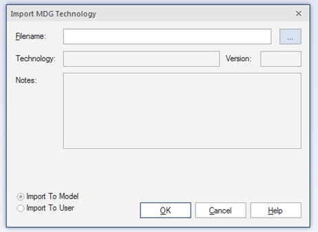
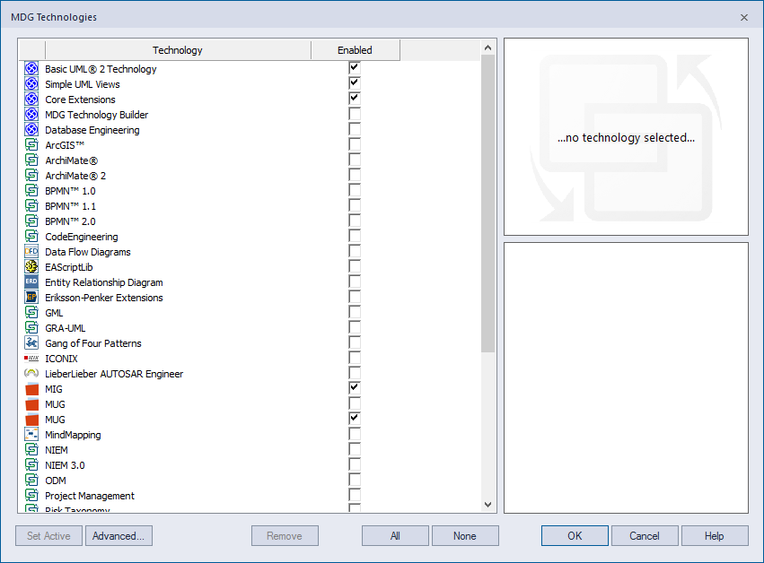
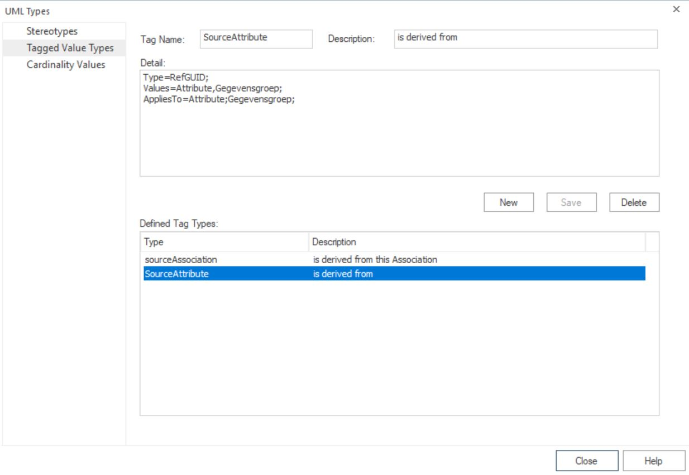

# 1. Installatie

## 1.1 Enterprise Architect configureren.

Om EA te gebruiken binnen de nieuwe aanpak zijn er een aantal handelingen vereist.
Ten eerste moet EA geïnstalleerd worden. Daarna moeten er een aantal externe tools en profiles geïmporteerd worden en ten slotte moeten er enkele configuratie acties binnen EA worden uitgevoerd. Deze handelingen worden hieronder beschreven.

### 1.1.1 Installeren EA

Benader voor het verkrijgen van het installatiescript de daarvoor verantwoordelijke persoon binnen uw organisatie.
Wij werken met versie 15.2. Als je deze al geïnstalleerd hebt hoef je EA natuurlijk niet opnieuw te installeren.

### 1.1.2 EA Toolpack installeren

Alhoewel deze toolpack niet meer noodzakelijk is voor het gebruik van imvertor biedt deze wel enkel handige tools zoals de Navigator en de Message Composer.

De nieuwste versie van dit script kan kostenloos worden opgehaald op de [website van Geert Bellekens](https://bellekens.com/product/bellekens-enterprise-architect-toolpack/) . Voeg EA Toolpack toe aan de winkelwagen. De website gebruikt een webshop om downloads aan te bieden. Het is niet verplicht een account aan te maken maar even naam en organisatie invullen moet wel. Na "afrekenen" kun je het bestand downloaden.

### 1.1.3 Imvertor Addin installeren

De imvertor Addin is noodzakelijk om UML-modellen vanuit EA te kunnen aanbieden aan de Armatiek-SAAS omgeving waar Imvertor draait. De nieuwste versie van deze Addin kan kostenloos worden opgehaald van het [Imvertor Dashboard](:https://imvertor.armatiek.nl/imvertor-executor/dashboard/wiki?key=info-EAADDIN). De documentatie over deze Addin en het gebruik vind je [hier](https://imvertor.armatiek.nl/imvertor-executor/dashboard/wiki?key=infoDOCIMVTOPEA).

### 1.1.4 Profielen/Metamodellen MIG en MUG importeren

De volgende metamodellen zijn beschikbaar (zie gelinkte bestanden):
 - [Metamodel Informatiemodellen Modellering:](./bestanden/VNGR%20SIM+Grouping%20NL-1.1-1.65.2.ea-toolbox.xml) (MIM)
 - [Metamodel UitwisselingsGegevensmodel VNG-R:](./bestanden/VNGR%20MUG+Grouping%20NL-1.0-1.65.2.ea-toolbox.xml) (MUG)
 - [Metamodel BerichtGevensmodel VNG-R:](./bestanden/VNGR%20MBG+Grouping%20NL-1.0-1.65.2.ea-toolbox.xml) (MBG)

Welke je moet installeren is afhankelijk van je werkzaamheden. Ben je alleen verantwoordelijk voor het produceren van SIM's of CIM's dan installeer je alleen de eerste. Indien je ook of juist verantwoordelijk bent voor het vervaardigen van UGM's dan installeer je de eerste en de tweede en als je BSM's moet kunnen maken dan dien je ze alledrie te installeren.

In Enterprise Architect kan je via *Specialize / Technologies / Publish-Tech / Import MDG Technology* de profielen met de metamodellen voor de diverse model-varianten importeren.

Let er wel op dat je de **"Import to User"** gebruikt, dan heb je immers in ieder project dat je opent of nieuw maakt de beschikking over deze profielen.

De Metamodellen komen dan beschikbaar in de Toolbox.

Noot: als je een profiel wilt verwijderen, dan kan je dat als volgt doen:
- als het profiel alleen in het 'model' is geïmporteerd dan kan het binnen Sparx verwijderd worden: **Specialize / Technology / Manage-Tech" (remove)**
- als het profiel in ‘User’ is opgenomen, dan moeten de bestanden handmatig worden verwijderd. Open Windows Explorer en ga naar %APPDATA%\Sparx Systems\EA\MDGTechnologies. Daarbij is %APPDATA% over het algemeen gelijk aan "C:\Users\%username%\AppData\Roaming\". Dus bijvoorbeeld: "C:\Users\Jans_J\AppData\Roaming\Sparx Systems\EA\MDGTechnologies".
Let op: de AppData folder is normaliter HIDDEN!
Verwijder vervolgens het betreffende MDG.bestand.

### 1.1.5 Activeren metamodellen

Na het laden van de MIG, MUG en MBG profielen (zie boven) moeten deze geactiveerd worden in de configuratie van de Schema Composer.  Deze is te bereiken via **Specialize / Technologies / Manage-Tech**.

In geval er meerdere MUG-profielen zichtbaar zijn in het configuratiescherm moeten deze alle aangevinkt worden wegens een onbekende bug in EA.

Tevens moet in en overbodige profielen uitgezet worden. De profielen die minimaal actief moeten zijn, zijn:
- 'Basic UML 2 Technology'
- 'Core Extensions'
- 'MIG' of 'MIM'
- 'MUG'
- 'MBG'

### 1.1.6  Aanpassen metamodellen

Zo nu en dan moeten de metamodellen worden aangepast. Bijv. omdat er nieuwe stereotypes geconfigureerd moeten worden.
Het toevoegen van nieuwe stereotypes kan pas gebeuren nadat dit goed is afgestemd met elkaar aangezien nieuwe stereotypes kunnen conflicteren met het MIG.

De metamodellen maar ook het EA project van waaruit de metamodellen aangepast worden zijn opgeslagen in de [SVN repository]( https://kinggemeenten.plan.io/svn/stuf-schemagenerator/KING%20Metamodel%20en%20profielen). Daar vindt je ook een handleiding hoe je vanuit het EA project de MDG profielen genereert.

### 1.1.7 SVN configureren voor EA

Hieronder worden de stappen beschreven die je moet doorlopen om Enterprise Architect geschikt te maken voor het werken met Subversion.

- Enterprise Architect werkt direct op subversion en niet met Tortoise. Je moet er dus voor zorgen dat je over de SVN executable ‘svn.exe’ beschikt. Dit kan door Tortoise te installeren. Heb je Tortoise al geïnstalleerd dan is de kans groot dat je de svn command line client niet hebt geïnstalleerd.  Installeer daarom Tortoise opnieuw of download de laatste versie van Tortoise en installeer deze. Selecteer daarbij in het Tortoise setup menu de optie ‘Will be installed on local hard drive’ bij ‘command line client tools’ en start daarna opnieuw op:

 

- Hierna dien je een working copy aan te maken in je filesysteem van de inmiddels vervaardigde EAP repository. Kies daarvoor eerst de gewenste locatie en creëer zo nodig een folder;
- Binnen de zojuist gekozen of vervaardigde folder check je vervolgens de repository met de EAP bestanden uit (op dit moment kun je deze [hier](https://vngrealisatie.plan.io/svn/modellen-repository.modellen-repository) vinden, Kies daarbij een naam voor de folder waarin deze moet worden uitgepakt (bijv. ‘EAP-bronnen’). Er worden nu lokaal een aantal folders en bestanden geplaatst;
- We gaan nu in EA een aantal versioncontrol configuraties aanmaken die je in de gelegenheid stellen eenvoudig naar de subversion folders te navigeren. Afhankelijk van welke modellen je denkt te gaan produceren moet je enkele of alle volgende configuraties aanmaken voor de volgende folders:
  - trunk/SIM;
  - trunk/UGM;
  - trunk/BSM;
  - branches/SIM;
  - branches/UGM;
  - branches/BSM;
  - tags/SIM;
  - tags/UGM;
  - tags/BSM.
- Open daarvoor in Enterprise Architect het lege template EA bestand dat je onderaan deze pagina in de bestandslijst kunt vinden. Hier gaan we niets mee doen maar:
  - een geopend EA bestand is een voorwaarde om SVN in Enterprise Architect te configureren;
  - het voorziet je al van de genoemde SVN configuraties die je dan alleen nog maar hoeft te vullen.
- Ga binnen Enterprise Architect naar **‘Configure / Version Control / Project-VC’**.
Je krijgt nu het volgende menu:

Waarbij je bij de 'Defined Configurations' dus al de negen genoemde configuraties ziet staan (in de illustratie hierboven is deze echter leeg).

- Voor elk van deze negen configuraties doe je nu het volgende:
  - Selecteer de configuratie;
  - Bepaal of de configuratie voor jou van toepassing zal zijn. Als je je nooit bezig houdt met het ontwikkelen van SIM's, heb je de configuratie 'Imvertor-trunk-SIM' niet nodig. Indien dit niet het geval is verwijder hem dan.
  - Indien de configuratie wel van toepassing is geef dan aan dat het version control van het type ‘Subversion’ is;
  - Kies het path naar de gerelateerde SVN folder. Helaas kan je daarbij geen copy and paste van een voorgaand path toepassen;
  - Geef aan waar de ‘svn.exe’ nu staat (dit hoef je waarschijnlijk alleen bij de eerste configuratie te doen);
 
- Bewaar de configuratie.

De volgorde waarin de configuraties zijn opgevoerd is bepalend voor de volgorde waarin deze verschijnen in het pull-down menu voor het ophalen van de packages. Indien je het meest modellen uit de tags ophaalt dan is het wellicht handiger om de configuraties 'Imvertor-tags-SIM', 'Imvertor-tags-UGM' en 'Imvertor-tags-BSM' als eerste op te voeren. In dat geval zul je de oude configuraties toch moeten verwijderen en de configuraties helemaal zelf op moeten voeren.

- Als je alle 9 configuraties hebt vervaardigd dan kan je het menu sluiten.
 

### 1.1.8 Tagged value SourceAttribute navigeerbaar (klikbaar) maken

- Ga naar _Configure / Reference Data / UML Types_, voeg daar de tag name 'SourceAttribute' toe (***Let op!*** hoofdletter 'S' en 'A') met de onderstaande vulling:

- Klik op _Save_.

### 1.1.9 Traceability script beschikbaar maken in project browser.

Installeer de laatste versie van het script die onderaan deze pagina is toegevoegd (Set Traceability Scripts with and without transformation 2021-11-29.xml ).

Het set traceability script wordt geimporteerd via "Configure / Model / Transfer / Import Reference Data / Shared File"

*Let op*: Een herstart van EA of zelfs van je systeem kan nodig zijn om de optie 'Scripts' in je context menu bij het rechtsklikken op een package te laten verschijnen.

Als je dat gedaan hebt zal je zien dat er nu in je context menu bij het rechtsklikken op een package een optie is bijgekomen:
'Scripts' met de subopties 'Set Traceability with Transformation' en 'Set Traceability without Transformation'. Indien deze niet in de projectbrowser te zien is moeten de volgende stappen uitgevoerd worden

> Het script is te vinden onder Specialize > Scripting.
> Maak in het opkomende menu een map "Package Group" aan als "new project browser group" (als die nog niet bestaat).
> Sleep het Traceability script (Main) van "KING scripts" naar "Package Group" .
> Nu is het script beschikbaar onder de rechtermuisknop op de Package in de project Browser (keuze scripting).

## Aan het werk

Je bent nu klaar om aan het werk te gaan. Het is echter handig om eerst de hoofdstukken [2 Begrippen](./Begrippen) en [3 Het drie-lagen model](./Drielagen-model) door te lezen. Daarna kun je m.b.v. hoofdstuk [4 Model Driven Design](./ModelDrivenDesign)  daadwerkelijk aan de slag.
